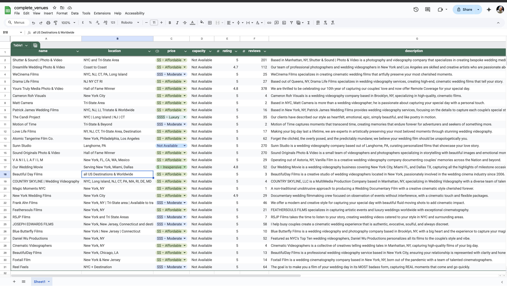

# Venue Lead Generation Project



This project is a web crawler built with Python that extracts venue data (wedding reception venues) from websites using asynchronous programming with Crawl4AI. It utilizes a language model-based extraction strategy and saves the collected data to Excel files.

## Features

- Asynchronous web crawling using Crawl4AI
- Data extraction powered by language models (LLM)
- Excel export of extracted venue information

### Prerequisites

- Python 3.9 or higher
- Conda (recommended for environment management)

### Installation

1. Clone the repository:

   ```bash
   git clone https://github.com/arunkumar201/learning-ai.git
   cd projects/lead_generation
   ```

2. Create and activate a Conda environment (recommended):

   ```bash
   conda create -n venue-crawler python=3.9 -y
   conda activate venue-crawler
   ```

3. Install required packages:

   ```bash
   pip install -r requirements.txt
   ```

### Environment Setup

Create a `.env` file in the root directory as per .env.example:

```bash
API_KEY=your_api_key_here
```

## Usage

To start the venue crawler:

```bash
python main.py
```

The script will:

1. Crawl specified websites
2. Extract venue data using LLM-based strategies
3. Save complete venue information to Excel files
4. Display usage statistics after crawling

## Configuration

The `config.py` file contains important constants used throughout the project:

- `BASE_URL`: Target website URL for venue extraction
- `CSS_SELECTOR`: Selectors for targeting venue content
- `REQUIRED_FIELDS`: Required fields for complete venue entries

## Additional Notes

- **Logging**: Currently uses print statements for status messages. Consider implementing Python's logging module for production use.
- **Code Structure**: Modular design for easy understanding and extensibility
- **Dependencies**: Ensure all package versions in `requirements.txt` are compatible
